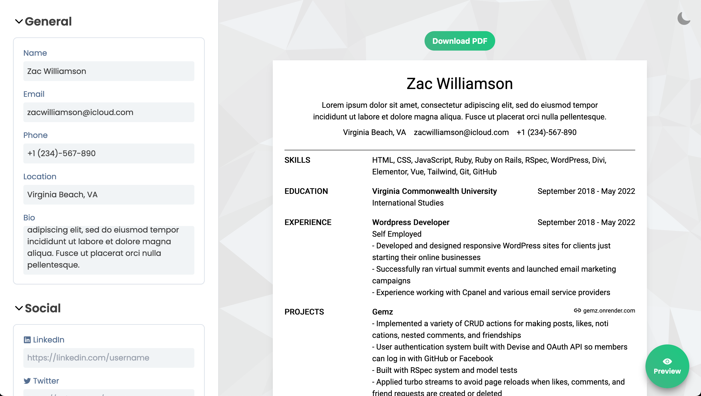

# Vue Resume

A simple resume builder created with Vue

## About

This is my first personal project built with Vue. I was inspired by [EasyResume's](https://app.easyresume.io/) UX/UI so some of the features/design are similar. Definatly feel more comfertable working with Vue than before this project. Nextime, I get to work on organizing my methods better, breaking down sections of my app into more components, and responsive design. Overall, this was a fun one and I look forward to getting better wieth Vue in the future!

## Features

- **Dark/Light Mode**

- **Responsive**

- **Chevron Togglers**

- **Reactive Experience**

  - Any changes made to the form immediately display on the doc layout

- **Custom Sections**

  - Users can create custom sections apart from the defaults (General, Skills, Education, Experience)

- **Sub sections**

  - Users can add more than one item for each form

- **Export to PDF**

  - Users can export single page PDF of the Resume

## Known Bugs

- PDF export does not display properly when too much content is added to doc

- Content overflows doc if too much is added
